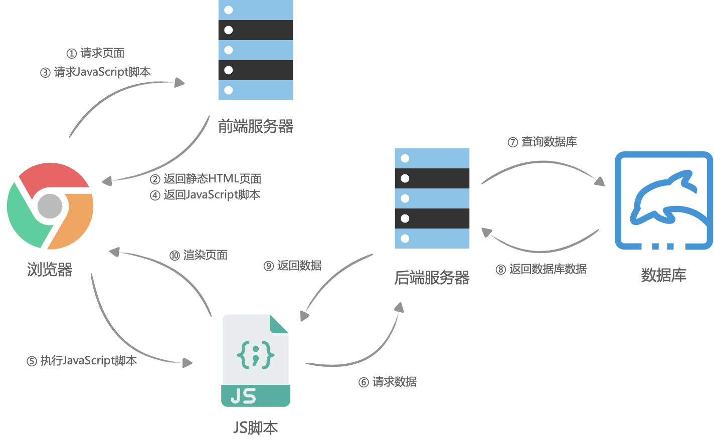
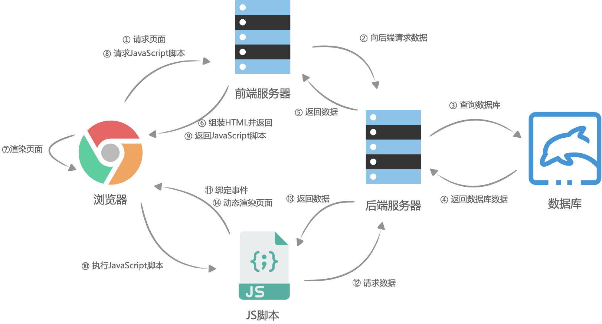

# 客户端渲染(CSR)服务端渲染(SSR)和预渲染(Prerendering)

## What is CSR
大体流程是这样的：首先浏览器请求URL，前端服务器直接返回一个空的静态HTML文件（不需要任何查数据库和模板组装），这个HTML文件中加载了很多渲染页面需要的 JavaScript 脚本和 CSS 样式表，浏览器拿到 HTML 文件后开始加载脚本和样式表，并且执行脚本，这个时候脚本请求后端服务提供的API，获取数据，获取完成后将数据通过JavaScript脚本动态的将数据渲染到页面中，完成页面显示。

### Experiment
Using react create a CSR demo

## What is SSR
随着单页应用（SPA）的发展，程序员们渐渐发现 SEO（Search Engine Optimazition，即搜索引擎优化）出了问题，而且随着应用的复杂化，JavaScript 脚本也不断的臃肿起来，使得首屏渲染相比于 Web1.0时候的服务端渲染，也慢了不少。

自己选的路，跪着也要走下去。于是前端团队选择了使用 nodejs 在服务器进行页面的渲染，进而再次出现了服务端渲染。大体流程与客户端渲染有些相似，首先是浏览器请求URL，前端服务器接收到URL请求之后，根据不同的URL，前端服务器向后端服务器请求数据，请求完成后，前端服务器会组装一个携带了具体数据的HTML文本，并且返回给浏览器，浏览器得到HTML之后开始渲染页面，同时，浏览器加载并执行 JavaScript 脚本，给页面上的元素绑定事件，让页面变得可交互，当用户与浏览器页面进行交互，如跳转到下一个页面时，浏览器会执行 JavaScript 脚本，向后端服务器请求数据，获取完数据之后再次执行 JavaScript 代码动态渲染页面。

## What is Prerendering

## 服务端渲染的利弊
相比于客户端渲染，服务端渲染有什么优势？

### 优点
相比于客户端渲染，服务端渲染有什么优势？

#### 利于SEO

有利于SEO，其实就是有利于爬虫来爬你的页面，然后在别人使用搜索引擎搜索相关的内容时，你的网页排行能靠得更前，这样你的流量就有越高。那为什么服务端渲染更利于爬虫爬你的页面呢？其实，爬虫也分低级爬虫和高级爬虫。

* 低级爬虫：只请求URL，URL返回的HTML是什么内容就爬什么内容。
* 高级爬虫：请求URL，加载并执行JavaScript脚本渲染页面，爬JavaScript渲染后的内容。

也就是说，低级爬虫对客户端渲染的页面来说，简直无能为力，因为返回的HTML是一个空壳，它需要执行 JavaScript 脚本之后才会渲染真正的页面。而目前像百度、谷歌、微软等公司，有一部分年代老旧的爬虫还属于低级爬虫，使用服务端渲染，对这些低级爬虫更加友好一些。

#### 白屏时间更短

相对于客户端渲染，服务端渲染在浏览器请求URL之后已经得到了一个带有数据的HTML文本，浏览器只需要解析HTML，直接构建DOM树就可以。而客户端渲染，需要先得到一个空的HTML页面，这个时候页面已经进入白屏，之后还需要经过加载并执行 JavaScript、请求后端服务器获取数据、JavaScript 渲染页面几个过程才可以看到最后的页面。特别是在复杂应用中，由于需要加载 JavaScript 脚本，越是复杂的应用，需要加载的 JavaScript 脚本就越多、越大，这会导致应用的首屏加载时间非常长，进而降低了体验感。

### 缺点
并不是所有的WEB应用都必须使用SSR，这需要开发者自己来权衡，因为服务端渲染会带来以下问题：

* 代码复杂度增加。为了实现服务端渲染，应用代码中需要兼容服务端和客户端两种运行情况，而一部分依赖的外部扩展库却只能在客户端运行，需要对其进行特殊处理，才能在服务器渲染应用程序中运行。
* 需要更多的服务器负载均衡。由于服务器增加了渲染HTML的需求，使得原本只需要输出静态资源文件的nodejs服务，新增了数据获取的IO和渲染HTML的CPU占用，如果流量突然暴增，有可能导致服务器down机，因此需要使用响应的缓存策略和准备相应的服务器负载。
* 涉及构建设置和部署的更多要求。与可以部署在任何静态文件服务器上的完全静态单页面应用程序 (SPA) 不同，服务器渲染应用程序，需要处于 Node.js server 运行环境。

所以在使用服务端渲染SSR之前，需要开发者考虑投入产出比，比如大部分应用系统都不需要SEO，而且首屏时间并没有非常的慢，如果使用SSR反而小题大做了。

## How to use SSR
知道了服务器渲染的利弊后，假如我们需要在项目中使用服务端渲染，我们需要做什么呢？那就是同构我们的项目。

### 同构的定义

在服务端渲染中，有两种页面渲染的方式：

* 前端服务器通过请求后端服务器获取数据并组装HTML返回给浏览器，浏览器直接解析HTML后渲染页面
* 浏览器在交互过程中，请求新的数据并动态更新渲染页面

这两种渲染方式有一个不同点就是，一个是在服务端中组装html的，一个是在客户端中组装html的，运行环境是不一样的。所谓同构，就是让一份代码，既可以在服务端中执行，也可以在客户端中执行，并且执行的效果都是一样的，都是完成这个html的组装，正确的显示页面。也就是说，一份代码，既可以客户端渲染，也可以服务端渲染。

### 同构的条件

为了实现同构，我们需要满足什么条件呢？首先，我们思考一个应用中一个页面的组成，假如我们使用的是`Vue.js`，当我们打开一个页面时，首先是打开这个页面的URL，这个URL，可以通过应用的`路由`匹配，找到具体的页面，不同的页面有不同的视图，那么，视图是什么？从应用的角度来看，视图 = `模板` + `数据`，那么在 Vue.js 中， 模板可以理解成`组件`，数据可以理解为`数据模型`，即响应式数据。所以，对于同构应用来说，我们必须实现客户端与服务端的路由、模型组件、数据模型的共享。

### Experiment
<!-- Use React to implement a SSR demo -->
ref

https://medium.com/jspoint/a-beginners-guide-to-react-server-side-rendering-ssr-bf3853841d55

https://asperbrothers.com/blog/server-side-rendering-in-react/

react demo
https://juejin.cn/post/6844903881390964744

## How to use Prerendering

