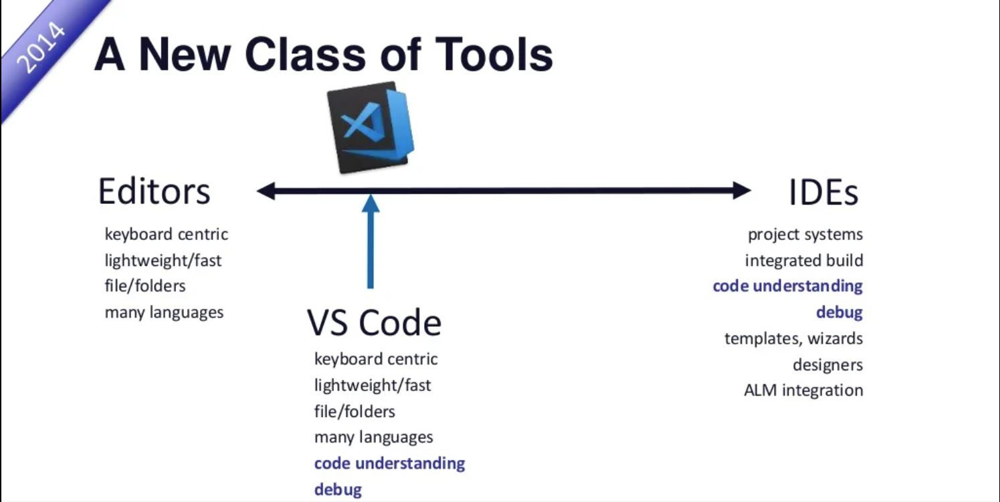
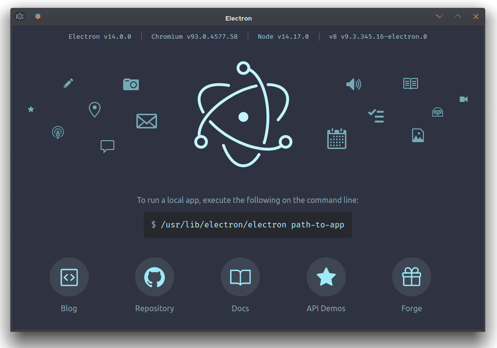
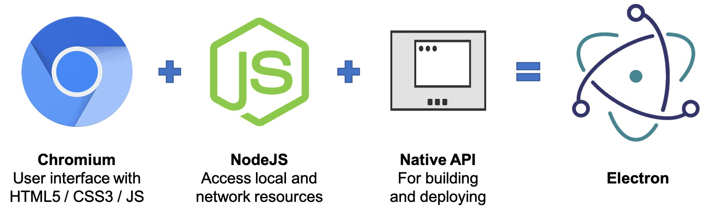
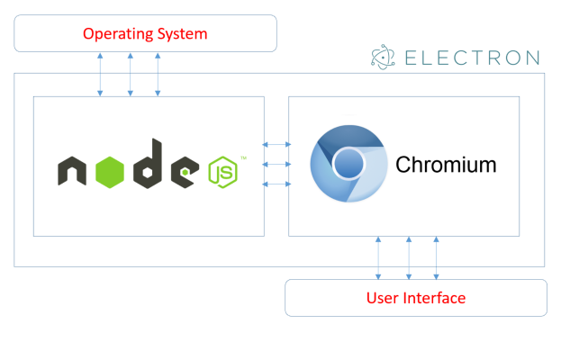
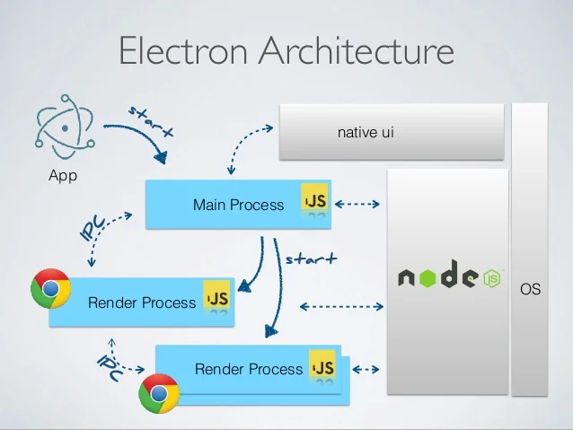
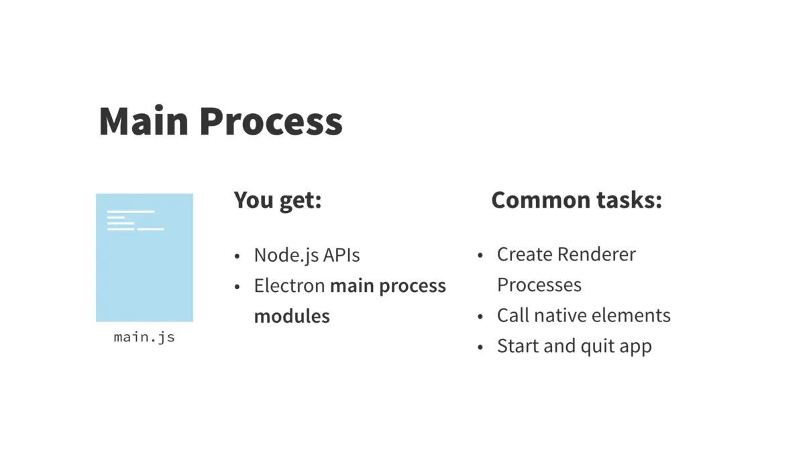
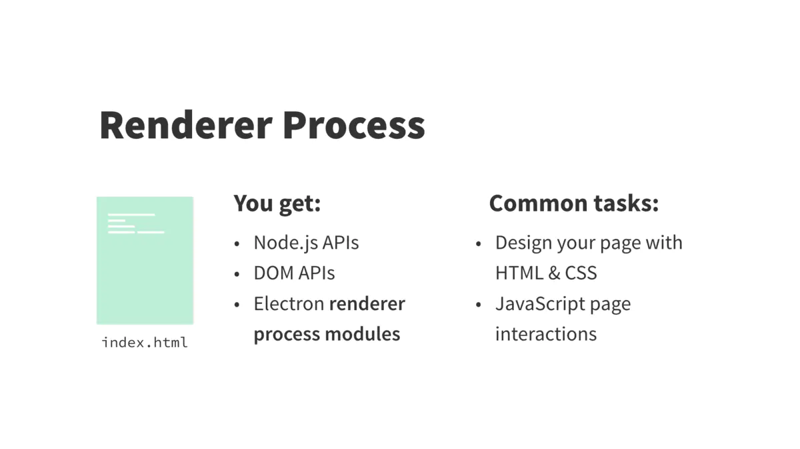
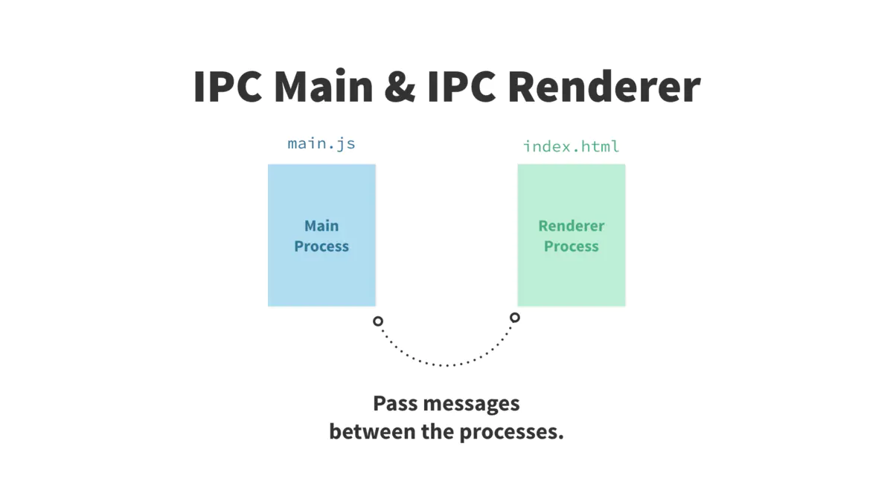
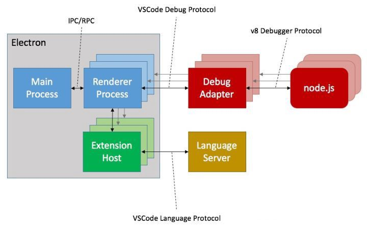

# VSCode 插件工作原理

## Todos
- [x] VSCode是什么
- [x] VSCode插件开发
- [ ] 插件开发实践
## Table of Contents
  * [VSCode是什么](##VSCode是什么)
    * [发展历程](###发展历程)
    * [产品定位](###产品定位)
    * [Electron](###Electron)
    * [VSCode技术架构](###VSCode技术架构)
  * [VSCode插件开发](##VSCode插件开发)
  * [插件开发实践](##插件开发实践)
    * [目标](###目标)
    * [Source Code](####Source%20Code)

## VSCode是什么

[Visual Studio Code](https://zh.wikipedia.org/wiki/Visual_Studio_Code)是由Microsoft开发的一款跨平台、开源代码编辑器(IDE)。

### 发展历程

* 2011-05  Erich加入微软，开发web IDE，让开发者能在浏览器中获得IDE般的开发体验。[Monaco Editor](https://microsoft.github.io/monaco-editor/)
* 2015-04  使用[Electron](https://www.electronjs.org/)技术将Monaco桌面化，发布VSCode。
* 2015-11 （发布之后半年）开源
* 2019-05 发布 VSCode Remote Development

### 产品定位

团队负责人[Erich Gamma](https://github.com/egamma) 讲解了在他开发 Eclipse 的过往经验基础上，对 VSCode 进行顶层设计时的诸多思路与决策，其中提到过对于 VSCode 的产品定位：

从图中可以看出 VSCode 定位是处于编辑器和 IDE 的中间并且偏向轻量编辑器一侧的。
VSCode 的核心是`编辑器` + `代码理解` + `调试`，围绕这个关键路径做深做透，其他东西非常克制，产品保持轻量与高性能。

**关键词：**

* 代码编辑（工具属性）
* 跨平台运行、开源
* 核心功能：
  - IntelliSense（代码提示）、 debugging（代码调试）、 git（代码管理） 都是围绕代码编辑的核心链路
  - extensions （插件）则肩负着打造开放生态的责任

### Electron

Electron is a framework for building desktop applications using JavaScript, HTML, and CSS. By embedding Chromium and Node.js into its binary, Electron allows you to maintain one JavaScript codebase and create cross-platform apps that work on Windows, macOS, and Linux — no native development experience required.

* 使用 Web 技术来编写 UI，用 chrome 浏览器内核来运行
* 使用 NodeJS 来操作文件系统和发起网络请求
* 使用 NodeJS C++ Addon 去调用操作系统的 native API

* 1 个主进程：一个 Electron App 只会启动一个主进程，它会运行 package.json 的 main 字段指定的脚本
* N 个渲染进程：主进程代码可以调用 Chromium API 创建任意多个 web 页面，而 Chromium 本身是多进程架构，每个 web 页面都运行在属于它自己的渲染进程中

进程间通讯：

* Render 进程之间的通讯本质上和多个 Web 页面之间通讯没有差别，可以使用各种浏览器能力如 localStorage
* Render 进程与 Main 进程之间也可以通过 API 互相通讯 (ipcRenderer/ipcMain)

### VSCode技术架构

* 主进程：VSCode 的入口进程，负责一些类似窗口管理、进程间通信、自动更新等全局任务
* 渲染进程：负责一个 Web 页面的渲染
* 插件宿主进程：每个插件的代码都会运行在一个独属于自己的NodeJS 环境的宿主进程中，插件不允许访问 UI
* Debug 进程：Debugger 相比普通插件做了特殊化
* Search 进程：搜索是一类计算密集型的任务，单开进程保证软件整体体验与性能

## VSCode插件开发

VSCode插件开发就是利用VSCode提供的`Extension API`进行自定义功能开发。VSCode插件时一个类似npm包的vsix文件。

**开发工具**
> // 安装脚手架
npm install -g yo generator-code
// 创建项目
yo code

上述命令其实安装了两个包（yo和generator-code)，这两个包用途如下：
* yo模块全局安装后就安装了Yeoman，Yeoman是通用型项目脚手架工具，可以根据一套模板，生成一个对应的项目结构。
* generator-code模块是VS Code扩展生成器，与yo配合使用才能构建项目。

More details can be found here https://code.visualstudio.com/api/get-started/your-first-extension

## 插件开发实践

### 目标

* 理解VSCode插件开发原理
* 掌握开发工具
* 实现一个简单的插件
  * 括号配对着色和彩虹缩进

### 测试
    // The command has been defined in the package.json file
    // Now provide the implementation of the command with registerCommand
    // The commandId parameter must match the command field in package.json
    let disposable = vscode.commands.registerCommand('my-colorizer.helloWorld', () => {
        // The code you place here will be executed every time your command is executed
        // Display a message box to the user
        vscode.window.showInformationMessage('Hello World from my-colorizer!');
    });

运行一下这个插件工程，按F5运行插件，这个时候会自动打开一个新的vscode界面，我们按`cmd+shift+p`，在命令框输入`my-colorizer.helloWorld`命令，既可以看到在vscode的界面的右下角弹出一个弹框，弹框显示**Hello World from my-colorizer!**，这正是我们在extension.js中为插件命令绑定的事件。

#### Source Code

[my-colorizer](./../examples/vscode-plugins/my-colorizer/)

